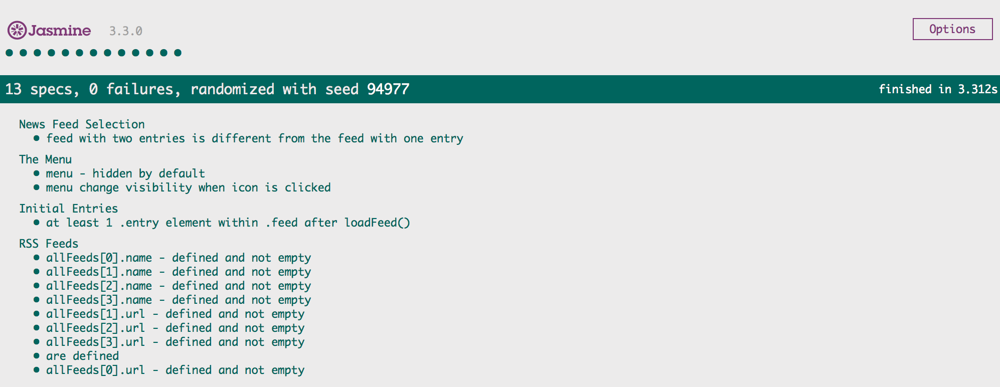

# Project Overview

In this project you are given a web-based application that reads RSS feeds. The original developer of this application clearly saw the value in testing, they've already included [Jasmine](http://jasmine.github.io/) and even started writing their first test suite! Unfortunately, they decided to move on to start their own company and we're now left with an application with an incomplete test suite. That's where you come in.

# INSTALLATION
Installs npm packages defined in package.json (assumed you have npm setup). The commands are run from a shell
```
npm install && npm audit fix
```

# RUNNING TESTS
Tests are at the bottom of the browser window - as shown in screenshot below. The command is run from a shell
```
gulp
```




